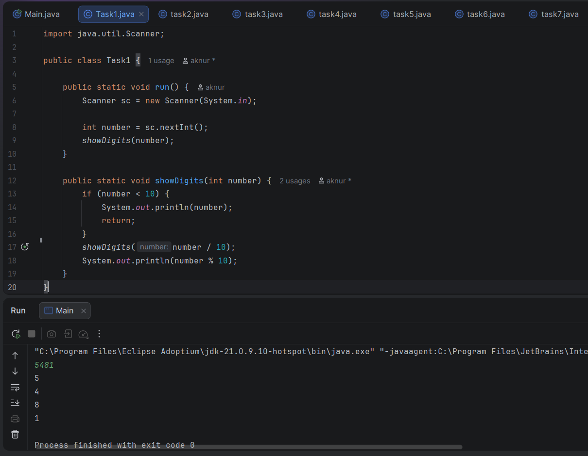
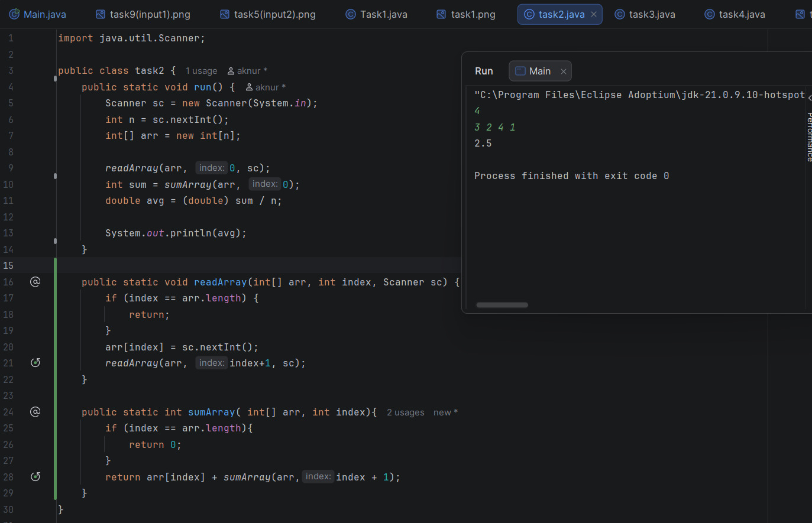
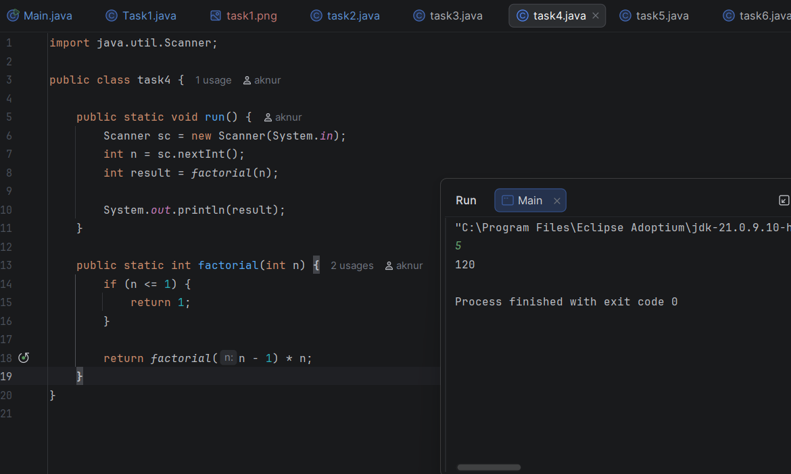
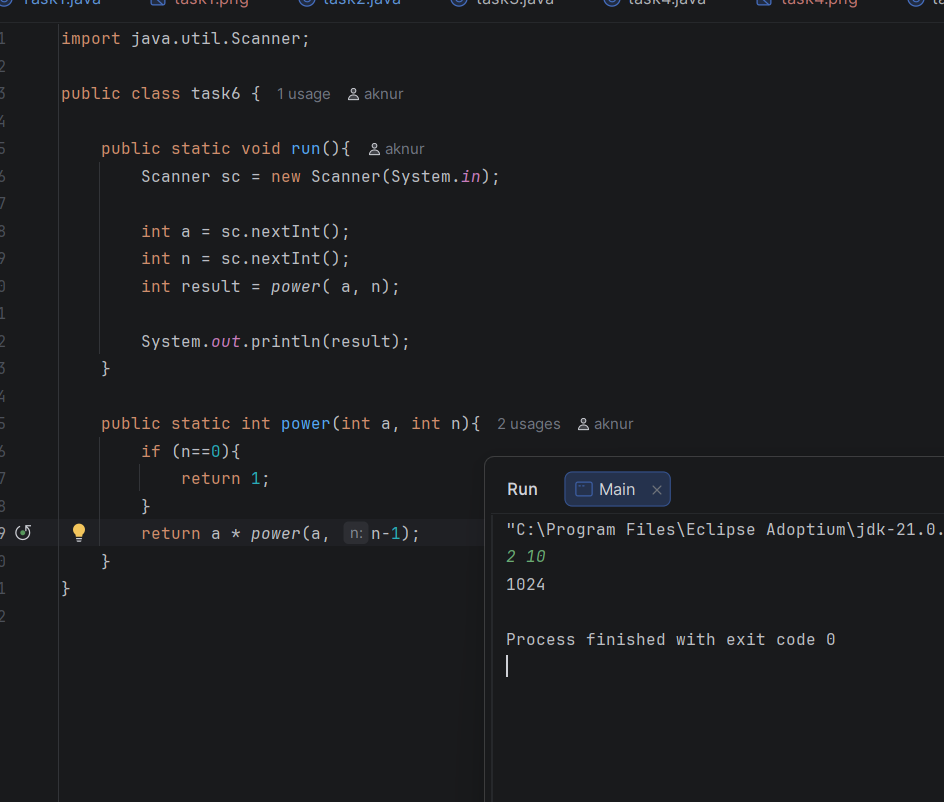
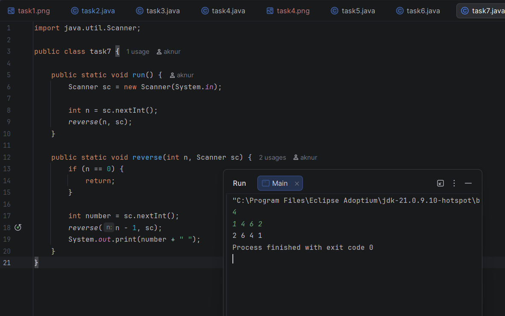

# ACD Assignment 1 - Recursion
## Student Information
Name: Galymzhankyzy Aknur
Group: IT - 2501

## Task 1 - Print Digits of a Number
- I solved this task using recursion. The function calls itself with the number divided by 10 until the number becomes a single digit (base case).
After the recursive call returns, the program prints the last digit using the operator `% 10`.

## Task 2 - Average of Elements
- In this task one recursive function reads the number into the array, and another recursive function calculates the sum of all elements. After obtaining sum,
I divided it to the number of elements.

## Task 3 - Prime Number Check
- To determine if a number is prime, I implemented a recursive function that checks divisibility starting from 2.
If the number is divisible by any value before reaching itself, it is composite. If there are no divisors, then, the number is prime. Also I screenshoted first
output with the code and the second one with the 'main' part where I just change the run command from task2.run(); to task3.run();
.png)
---
.png)

## Task 4 - Factorial
- The factorial was calculated using a recursive definition. The base case occurs when the number is 0 or 1, where the result is 1. 
Otherwise, the function multiplies the current number by the factorial of the previous number.

## Task 5 - Fibonacci Number
- In this task I created a recursive function that returns 0 when n equals 0 and returns 1 when n equals 1 (these are the base cases). 
For other values, the function calls itself with `n - 1` and `n - 2` and adds the results to get the Fibonacci number.
.png)
.png)

## Task 6 - Power Function
- Here to compute a number raised to a power, recursion was used. The base case is when the exponent equals 0, which returns 1. 
Otherwise, the function multiplies the base number by the result of the function with the exponent decreased by one.

## Task 7 - Reverse Order of Numbers
- In this task I printed numbers in reverse order using recursion without using an array. The program reads one number and then calls the same function for the remaining 
numbers. The number is printed only after the recursive call finishes, which makes the output appear in reverse order.

## Task 8 - Check Digits in String
- For this task I wrote a recursive function that checks every character in the string. The function moves through the string using an index and verifies whether each
character is a digit using `Character.isDigit()`. If a character is not a digit, the function returns false. If the end of the string is reached, the function returns true.
.png)
.png)

## Task 9 - Count Characters in a String
- In this task I counted the number of characters in a string using recursion. The function checks the current position in the string and then calls itself for the
next position. Each recursive call adds 1 until the index reaches the length of the string, which is the base case.
.png)
.png)

## Task 10 - Greatest Common Divisor (GCD)
- To solve this task I used the recursive Euclidean algorithm. The function repeatedly calls itself with the values `(b, a % b)` until the second number becomes zero.
When `b` equals 0, the first number is returned as the greatest common divisor.

.png)
.png)

## Work Process Summary

First, I read the assignment requirements and divided the problems into separate tasks. For each task I created a separate Java file and implemented the solution 
using recursion. I identified the base case and the recursive step for each problem and tested the program with different inputs to make sure it worked correctly. 
After completing the tasks, I took screenshots of the outputs and prepared the GitHub repository with the source code and report.
---
